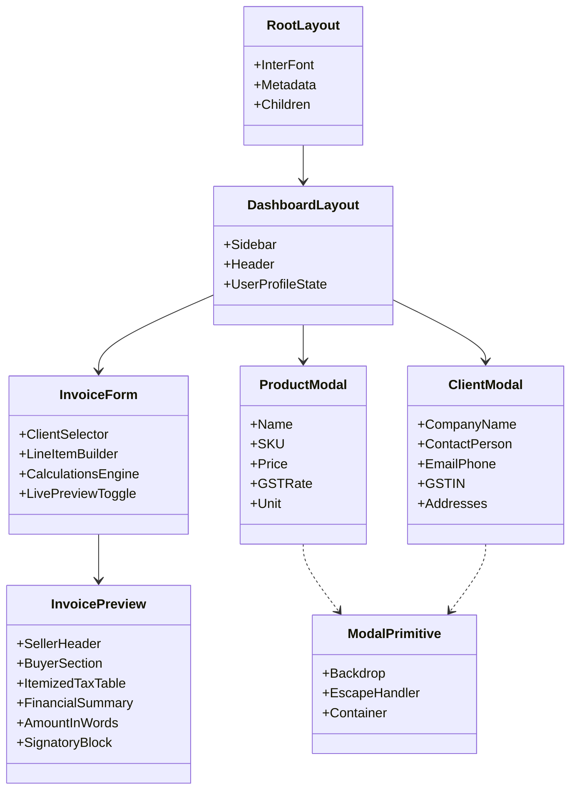
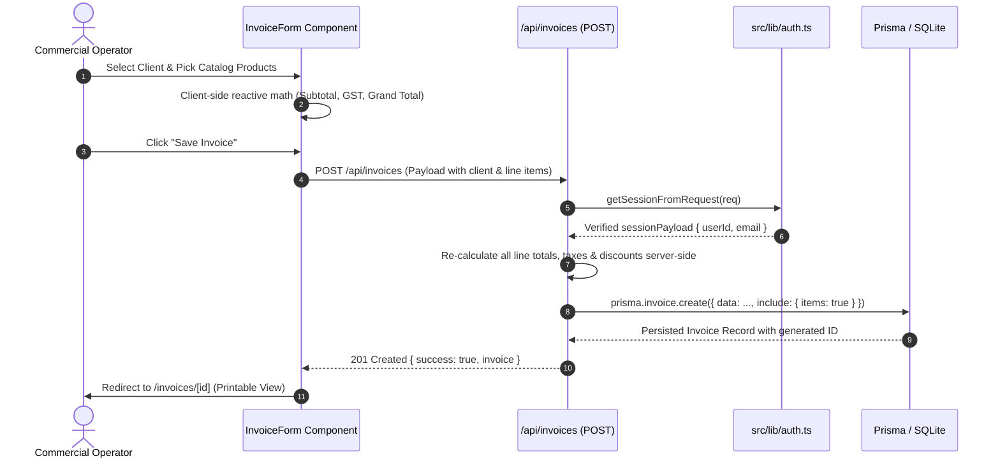
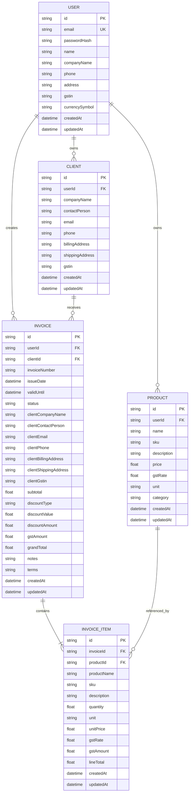

# System Architecture & Technical Specifications — InvoiceFlow

**Document Version:** 1.0.0  
**Status:** Active  
**Last Updated:** September 2026  

---

## 1. High-Level System Architecture

InvoiceFlow is structured as a fullstack, modular web application utilizing the **Next.js App Router** paradigm. The architecture cleanly separates presentation, business logic, authentication, and data access layers:

```
┌────────────────────────────────────────────────────────────────────────┐
│                          Client Browser                                │
│  (Next.js App Router, React Server/Client Components, Tailwind CSS)   │
└───────────────────────────────────┬────────────────────────────────────┘
                                    │
                                    │ HTTP Requests / API Calls / Cookies
                                    ▼
┌────────────────────────────────────────────────────────────────────────┐
│                       Next.js Edge Middleware                          │
│     (src/middleware.ts - Route Guarding & JWT Token Verification)      │
└───────────────────────────────────┬────────────────────────────────────┘
                                    │
                                    ▼
┌────────────────────────────────────────────────────────────────────────┐
│                        API Route Handlers                              │
│       (/api/auth/*, /api/invoices/*, /api/products/*, /api/clients/*)  │
│         - Input Validation                                             │
│         - Session Context Resolution (src/lib/auth.ts)                 │
│         - Server-Side Financial Re-Calculation                         │
└───────────────────────────────────┬────────────────────────────────────┘
                                    │
                                    ▼
┌────────────────────────────────────────────────────────────────────────┐
│                        Data Access Layer                               │
│              (Prisma ORM Client Singleton - src/lib/db.ts)             │
└───────────────────────────────────┬────────────────────────────────────┘
                                    │
                                    ▼
┌────────────────────────────────────────────────────────────────────────┐
│                          Database Storage                              │
│       (SQLite dev.db for local dev / PostgreSQL for Production)        │
└────────────────────────────────────────────────────────────────────────┘
```

---

## 2. Technology Stack & Technical Justification

| Category | Technology | Version | Technical Justification |
|---|---|---|---|
| **Framework** | Next.js (App Router) | `^14.2.35` | Hybrid Server Components for fast SEO & SSR, API Route Handlers, and Edge Middleware for route protection. |
| **Language** | TypeScript | `^5.7.2` | Full static type safety across database models, API payloads, and frontend state interfaces. |
| **Styling** | Tailwind CSS | `^3.4.16` | Utility-first responsive design, custom color system, and dedicated `@media print` rules for A4 paper. |
| **Icons** | Lucide React | `^0.468.0` | Comprehensive, consistent, light-weight SVG iconography. |
| **ORM** | Prisma ORM | `^5.22.0` | Declarative schema, type-safe auto-generated query client, migrations, and relationship management. |
| **Database** | SQLite (dev) | — | Zero external setup required for instant local execution (`file:./dev.db`), easily swappable to PostgreSQL. |
| **Auth / Cryptography** | `jose` & `bcryptjs` | `^5.9.6` / `^2.4.3` | `jose` provides Edge-compatible Web Crypto JWT signing; `bcryptjs` provides secure, salted password hashing. |

---

## 3. Directory & Folder Structure

```
InvoiceFlow/
├── .env                     # Environment variables (DATABASE_URL, JWT_SECRET)
├── .env.example             # Template environment variables
├── .eslintrc.json           # ESLint configuration
├── .gitignore               # Version control exclusion rules
├── README.md                # Project documentation and quick-start guide
├── next.config.mjs          # Next.js configuration
├── package.json             # Dependencies, scripts, and Prisma seed definition
├── postcss.config.js        # PostCSS configuration for Tailwind CSS
├── tailwind.config.ts       # Tailwind CSS theme extension
├── tsconfig.json            # TypeScript path aliasing configuration (@/*)
├── docs/                    # Technical & Product Documentation
│   ├── PRD.md               # Product Requirements Document
│   ├── ROADMAP.md           # Product Roadmap & Delivery Horizons
│   └── ARCHITECTURE.md      # System Architecture & Technical Specifications
├── prisma/
│   ├── schema.prisma        # Prisma database schema definition
│   └── seed.ts              # Seeding script with demo user and business records
└── src/
    ├── middleware.ts        # Edge authentication and route protection middleware
    ├── app/
    │   ├── layout.tsx       # Root layout defining Inter font & metadata
    │   ├── globals.css      # Tailwind base and print media CSS rules
    │   ├── page.tsx         # High-impact SaaS public landing page
    │   ├── login/page.tsx   # User authentication login view
    │   ├── register/page.tsx# User registration view
    │   ├── (dashboard)/     # Authenticated dashboard route group
    │   │   ├── layout.tsx   # Authenticated shell (Sidebar + Header + Session)
    │   │   ├── dashboard/   # Executive KPI cards & recent invoices table
    │   │   ├── products/    # Product catalog management page
    │   │   ├── clients/     # Client directory management page
    │   │   ├── settings/    # Seller company profile & GSTIN settings
    │   │   └── invoices/    # Invoice history, search, and status filtering
    │   │       ├── new/     # Interactive invoice creator page
    │   │       └── [id]/    # Printable invoice view & PDF export
    │   │           └── edit/# Invoice editor page
    │   └── api/             # RESTful API route handlers
    │       ├── auth/        # /login, /register, /logout, /me
    │       ├── products/    # /products & /products/[id]
    │       ├── clients/     # /clients & /clients/[id]
    │       ├── invoices/    # /invoices, /invoices/[id], /invoices/next-number
    │       ├── dashboard/   # /dashboard/stats
    │       ├── user/        # /user/profile
    │       └── seed/        # 1-Click demo seeder endpoint
    ├── components/
    │   ├── layout/          # Sidebar.tsx & Header.tsx
    │   ├── ui/              # Modal.tsx (reusable modal primitive)
    │   ├── products/        # ProductModal.tsx (Create & Edit product form)
    │   ├── clients/         # ClientModal.tsx (Create & Edit client form)
    │   ├── invoices/        # InvoiceForm.tsx & InvoicePreview.tsx
    │   └── landing/         # Modular landing page presentation components
    └── lib/
        ├── auth.ts          # JWT token signing, verification & cookie extraction
        ├── db.ts            # Prisma Client singleton
        ├── types.ts         # TypeScript application interfaces
        └── utils.ts         # Currency formatting, date parsing & number-to-words
```

---

## 4. Component Architecture & Hierarchy

The frontend follows a component hierarchy:



---

## 5. End-to-End Data Flow

The following diagram traces the end-to-end data flow when a user creates a new Proforma Invoice:



---

## 6. Database Schema & Entity Relationships

The relational schema is defined in [`prisma/schema.prisma`](file:///Users/rajan/Desktop/InvoiceFlow/prisma/schema.prisma):



### Snapshotting Pattern for Invoices
When an invoice is saved, the client's company name, contact person, email, phone, billing address, delivery address, and GSTIN are **snapshotted directly onto the `Invoice` model**. This guarantees that if a client's address or tax ID changes in the future, past legally issued invoices remain historically immutable.

---

## 7. API Route Catalogue

All API routes enforce authentication and input validation:

| Method | Endpoint | Description | Auth Required |
|---|---|---|---|
| `POST` | `/api/auth/register` | Register new user account; seeds sample data and sets session cookie. | No |
| `POST` | `/api/auth/login` | Verify credentials, return user profile, and set session cookie. | No |
| `POST` | `/api/auth/logout` | Invalidate session by deleting the HTTP-only cookie. | No |
| `GET` | `/api/auth/me` | Fetch authenticated user's profile and company settings. | Yes |
| `PUT` | `/api/user/profile` | Update seller business name, address, GSTIN, and currency. | Yes |
| `GET` | `/api/products` | List user's products with optional search query and category filter. | Yes |
| `POST` | `/api/products` | Create a new catalog item with SKU, unit price, and GST rate. | Yes |
| `GET` | `/api/products/[id]` | Fetch single product by ID. | Yes |
| `PUT` | `/api/products/[id]` | Update product details. | Yes |
| `DELETE` | `/api/products/[id]` | Permanently delete product. | Yes |
| `GET` | `/api/clients` | List user's saved clients with search query. | Yes |
| `POST` | `/api/clients` | Create client record with addresses and GSTIN. | Yes |
| `GET` | `/api/clients/[id]` | Fetch single client by ID. | Yes |
| `PUT` | `/api/clients/[id]` | Update client record. | Yes |
| `DELETE` | `/api/clients/[id]` | Permanently delete client. | Yes |
| `GET` | `/api/invoices` | List invoices with status filter and keyword search. | Yes |
| `POST` | `/api/invoices` | Create proforma invoice with server-side recalculated financial totals. | Yes |
| `GET` | `/api/invoices/[id]` | Fetch invoice details with line items, client, and seller metadata. | Yes |
| `PUT` | `/api/invoices/[id]` | Update invoice details, replace line items, and recalculate totals. | Yes |
| `DELETE` | `/api/invoices/[id]` | Delete invoice and cascade delete its line items. | Yes |
| `GET` | `/api/invoices/next-number` | Query next sequential invoice number (e.g. `PI-2026-002`). | Yes |
| `GET` | `/api/dashboard/stats` | Aggregate dashboard KPIs, recent invoices, and status counts. | Yes |
| `POST` | `/api/seed` | Seed realistic demo products, clients, and an active invoice. | Yes |

---

## 8. Authentication & Security Implementation

### Edge Middleware Token Guarding
Located in [`src/middleware.ts`](file:///Users/rajan/Desktop/InvoiceFlow/src/middleware.ts):
```ts
export async function middleware(request: NextRequest) {
  const { pathname } = request.nextUrl;
  const token = request.cookies.get(COOKIE_NAME)?.value;

  let isAuthenticated = false;
  if (token) {
    try {
      await jwtVerify(token, SECRET);
      isAuthenticated = true;
    } catch {
      isAuthenticated = false;
    }
  }

  const isAuthPage = pathname.startsWith("/login") || pathname.startsWith("/register");
  const isProtectedPage =
    pathname.startsWith("/dashboard") ||
    pathname.startsWith("/products") ||
    pathname.startsWith("/clients") ||
    pathname.startsWith("/invoices") ||
    pathname.startsWith("/settings");

  if (isProtectedPage && !isAuthenticated) {
    const loginUrl = new URL("/login", request.url);
    loginUrl.searchParams.set("from", pathname);
    return NextResponse.redirect(loginUrl);
  }

  if (isAuthPage && isAuthenticated) {
    return NextResponse.redirect(new URL("/dashboard", request.url));
  }

  return NextResponse.next();
}
```

### Session Payload Contract
```ts
export interface SessionPayload {
  userId: string;
  email: string;
  name: string;
}
```

### Password Salting & Hashing
Passwords are salted and hashed using `bcryptjs` with a cost factor of 10 prior to database write operations. Raw passwords are never persisted or returned in API responses.

---

## 9. Print & PDF Styling Architecture

InvoiceFlow avoids heavyweight server-side headless browser rendering dependencies (such as Puppeteer) in favor of standard, lightweight `@media print` CSS compilation in [`src/app/globals.css`](file:///Users/rajan/Desktop/InvoiceFlow/src/app/globals.css):

```css
@media print {
  body {
    background: #ffffff !important;
    color: #000000 !important;
    margin: 0 !important;
    padding: 0 !important;
  }

  .no-print {
    display: none !important;
  }

  .print-only {
    display: block !important;
  }

  .invoice-paper {
    box-shadow: none !important;
    border: none !important;
    width: 100% !important;
    max-width: 100% !important;
    margin: 0 !important;
    padding: 24px !important;
  }

  @page {
    size: A4 portrait;
    margin: 12mm;
  }
}
```

This ensures that calling `window.print()` triggers the browser's native print-to-PDF dialogue, generating a crisp, high-resolution vector PDF document.
