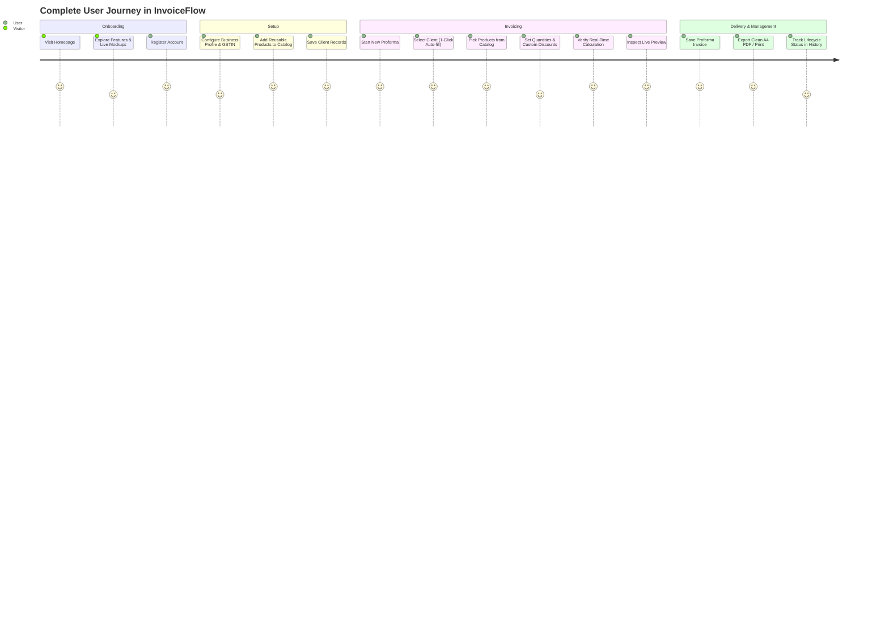
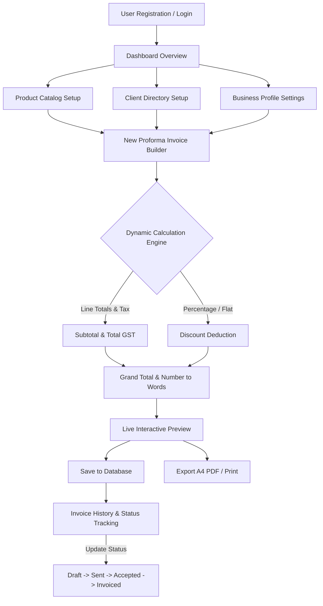

# Product Requirements Document (PRD) — InvoiceFlow

**Document Version:** 1.0.0  
**Status:** Approved  
**Author:** Rajan Puri  
**Target Release:** MVP & Beyond  

---

## 1. Product Overview

**InvoiceFlow** is a modern, web-based SaaS application specifically engineered for generating, managing, and issuing commercial **Proforma Invoices**. Built to streamline pre-billing commercial transactions, InvoiceFlow bridges the operational gap between initial commercial proposals and final tax invoices.

The platform provides businesses, agencies, and independent professionals with an integrated system to maintain reusable product/service catalogs, preserve verified customer profiles with GST registrations, compute multi-slab GST taxes automatically, preview invoices in real time, and export pixel-perfect, legal-standard A4 printable PDFs.

---

## 2. Problem Statement

Small and medium-sized businesses, service agencies, and freelancers face significant friction when issuing commercial quotes and proforma invoices:

1. **Manual Spreadsheet Fragility:** Teams typically use Excel, Google Sheets, or Microsoft Word templates. Formulas are prone to accidental modification, causing math errors in totals, discounts, or tax figures.
2. **Repetitive Data Entry:** Sellers frequently retype item codes, descriptions, prices, client addresses, and 15-digit GSTIN IDs for every new transaction, wasting hours each week.
3. **Complex Indian GST Calculations:** Calculating applicable GST slabs (0%, 5%, 12%, 18%, 28%), line-item tax distributions, discount deductions, and converting numerical totals into legal words format is tedious and error-prone.
4. **Unprofessional Documentation:** Word processors often distort margins, page breaks, and table borders upon PDF export, leading to unaligned documents that harm vendor credibility.
5. **Lack of Centralized Tracking:** Once a quote or proforma is exported and emailed, it is lost in email threads or local desktop folders with no visibility into status (`DRAFT`, `SENT`, `ACCEPTED`, `DECLINED`, `EXPIRED`).

---

## 3. Target Users

| User Persona | Profile & Needs | Primary Use Case |
|---|---|---|
| **Small Business Owners & Traders** | Operating trading, manufacturing, or distribution businesses. Require rapid quotes with correct GST compliance without enterprise ERP complexity. | Generate quotes for supply orders, verify buyer GSTINs, and attach proformas to purchase orders. |
| **Agencies & Consultancies** | Software, marketing, and design firms billing recurring retainers, fixed milestones, and dedicated sprint hours. | Package multi-item scopes of work, apply bespoke project discounts, and specify milestone payment terms. |
| **Freelancers & Solopreneurs** | Independent developers, designers, and domain specialists needing corporate-grade documentation. | Produce professional commercial proformas with automated tax calculations and bank transfer instructions. |

---

## 4. Product Goals & Success Metrics

### Primary Goals
- **Speed:** Reduce proforma invoice generation time from 15–20 minutes to under 2 minutes.
- **Accuracy:** Ensure 100% computational precision across multi-item GST rates, discounts, and legal rupee words.
- **Compliance:** Provide standard-compliant documentation displaying both Seller and Buyer GSTINs, HSN/SKU codes, and itemized tax breakdowns.
- **Simplicity:** Provide a zero-friction user experience with no training required.

### Success Metrics (KPIs)
- **Time to First Invoice:** New user registration to generated PDF in < 3 minutes.
- **Invoice Volume:** Number of invoices generated per active user per month.
- **Catalog Reuse Rate:** Over 80% of invoice line items populated from the saved product catalog.
- **Client Auto-Fill Rate:** Over 85% of invoices populated from saved client records.

---

## 5. Core Features

1. **Account Management & Authentication:** Secure email/password login, bcrypt hashing, and HTTP-only session cookies.
2. **Executive Dashboard:** Live metrics for total invoice volume, cumulative revenue, active product count, and client database size.
3. **Product & Service Catalog:** Full CRUD operations for products with SKU, unit price, GST slab (0%–28%), standard unit, and category.
4. **Client Directory:** Full CRUD operations for clients with legal entity name, contact person, email, phone, billing address, delivery address, and GSTIN.
5. **Interactive Proforma Invoice Builder:**
   - Auto-generated sequential invoice numbers (e.g., `PI-2026-001`).
   - 1-Click client selector.
   - Dynamic product line picker with override support.
   - Real-time calculations: subtotal, discount (percentage or flat), aggregate GST, and grand total.
   - Dynamic conversion of grand total into words (Indian numbering system).
6. **Live Document Preview & A4 PDF Engine:** In-app real-time preview and dedicated `@media print` layout engineered for standard A4 portrait output.
7. **Invoice History & Lifecycle Tracking:** Searchable, filterable archive supporting status workflows (`DRAFT`, `SENT`, `ACCEPTED`, `DECLINED`, `EXPIRED`).
8. **Business Profile & Settings:** Configurable company header, registered address, GSTIN, and currency symbols (`₹`, `$`, `€`, `£`, `AED`).

---

## 6. User Roles & Permissions

In the current version, InvoiceFlow enforces strict **Single-Tenant Workspace Isolation**:
- **Owner / Administrator:** Each registered user owns their workspace. They have full permissions to view, create, edit, and delete their own products, clients, invoices, and business profile settings.
- **Data Isolation:** Prisma queries strictly scope all read and write queries to `userId: session.userId`. No user can access or query another user's business records.

*(Multi-user role-based access control such as Admin, Accountant, and Viewer is planned for Phase 3).*

---

## 7. Complete User Journey

---

## 8. Product Architecture & Workflow

---

## 9. Invoice Creation Workflow

1. **Initiate Creation:** User navigates to `/invoices/new` via the sidebar or top header CTA.
2. **Auto-Numbering:** The system automatically queries `/api/invoices/next-number` and formats the sequential invoice number (e.g. `PI-2026-001`).
3. **Date Configuration:** Default issue date set to today; validity window defaults to 15 days ahead (editable).
4. **Client Selection:**
   - User selects an existing client from a dropdown: Company name, GSTIN, contact person, email, phone, and billing/shipping addresses are auto-populated.
   - Alternatively, user manually types custom client details for one-off transactions.
5. **Item Population:**
   - User clicks **"Pick saved product"**: Item name, SKU, description, unit, unit price, and GST rate populate automatically.
   - User inputs or adjusts **Quantity** (default: 1).
   - User can add custom lines on the fly or delete unneeded lines.
6. **Live Computation:**
   - System calculates base amount: $\text{Quantity} \times \text{Unit Price}$.
   - System calculates item tax: $\text{Base Amount} \times (\text{GST Rate} / 100)$.
   - System sums pre-tax subtotal and total GST.
   - User enters discount (Percentage or Flat Rupee amount).
   - System computes: $\text{Grand Total} = \text{Subtotal} - \text{Discount} + \text{Total GST}$.
   - System converts grand total into legal rupee words.
7. **Notes & Terms:** User specifies bank details, wire instructions, delivery clauses, or warranty terms.
8. **Preview & Save:** User toggles between **Edit Form** and **Live Preview**, then clicks **Save Invoice** to persist to the database and redirect to the printable view.

---

## 10. Product Management Specifications

### Data Model
- **Product Name** (`name`): String, required, max 255 chars.
- **SKU Code** (`sku`): String, optional, alphanumeric identifier.
- **Description** (`description`): Text, optional, specs or scope of work.
- **Unit Price** (`price`): Float, required, non-negative.
- **GST Rate** (`gstRate`): Float, default 18.0. Supported values: `0`, `5`, `12`, `18`, `28`.
- **Unit** (`unit`): String, default `PCS`. Supported: `PCS`, `NOS`, `BOX`, `KG`, `MTR`, `HRS`, `SET`, `PKG`.
- **Category** (`category`): String, optional, for organizational grouping.

### Requirements
- Modal-driven creation and editing to prevent losing context.
- Instant search across name, SKU, description, and category.
- Category filter dropdown dynamically derived from active catalog items.
- Confirmation modal before permanent item deletion.

---

## 11. Client Management Specifications

### Data Model
- **Company Name** (`companyName`): String, required, legal business name.
- **Contact Person** (`contactPerson`): String, optional, primary contact.
- **Email** (`email`): String, optional, valid email format.
- **Phone** (`phone`): String, optional, primary contact telephone.
- **Billing Address** (`billingAddress`): Text, optional, registered business address.
- **Shipping Address** (`shippingAddress`): Text, optional, delivery site address.
- **GSTIN** (`gstin`): String, optional, 15-character uppercase alphanumeric tax identifier.

### Requirements
- Convenient "Same as billing address" checkbox to sync addresses automatically.
- Uppercase normalization and font-mono styling for GSTIN fields.
- Real-time search across company name, contact, email, and GSTIN.
- Cascade protection: deleting a client retains historic invoices by setting `clientId = null` while preserving client snapshot data on the invoice record.

---

## 12. GST Calculation Engine Specifications

### Regulatory Framework
Designed primarily for the Indian Goods and Services Tax (GST) framework while remaining flexible for general international value-added tax structures:

$$\text{Line Base} = \text{Quantity} \times \text{Unit Price}$$
$$\text{Line Tax} = \text{Line Base} \times \left(\frac{\text{GST Rate}}{100}\right)$$
$$\text{Line Total} = \text{Line Base} + \text{Line Tax}$$
$$\text{Subtotal} = \sum \text{Line Base}$$
$$\text{Total GST} = \sum \text{Line Tax}$$

### Discount Mechanics
- **Percentage Discount:** $\text{Discount Amount} = \text{Subtotal} \times \left(\frac{\text{Discount Value}}{100}\right)$
- **Fixed Discount:** $\text{Discount Amount} = \min(\text{Discount Value}, \text{Subtotal})$
- **Taxable Value:** $\text{Taxable Value} = \text{Subtotal} - \text{Discount Amount}$
- **Grand Total:** $\text{Grand Total} = \text{Taxable Value} + \text{Total GST}$

### Number to Words Translation
Implements the Indian numbering system (*Lakhs* and *Crores*) with fractional *Paise* support:
- Example: `₹1,47,500.50` $\rightarrow$ *"One Lakh Forty Seven Thousand Five Hundred Rupees and Fifty Paise Only"*.

---

## 13. PDF Generation & Printing Specifications

- **Media Standard:** Standard ISO A4 portrait dimensions ($210\text{ mm} \times 297\text{ mm}$).
- **Print Optimization:** Dedicated `@media print` CSS rules hiding navigation, buttons, and headers, rendering high-contrast pure white/black typography with 12mm print margins.
- **Document Sections:**
  1. Header with seller branding, registered address, seller GSTIN, and prominent `PROFORMA INVOICE` badge.
  2. Invoice metadata block: Sequential invoice number, issue date, validity window, and status.
  3. Buyer section: Legal entity name, contact person, buyer GSTIN, and billing/shipping addresses.
  4. Itemized tax table: Serial number, item description, SKU, quantity, unit, unit rate, GST rate, tax amount, and line total.
  5. Computation breakdown: Subtotal, discount amount, aggregate GST, and grand total.
  6. Legal amount in words notation.
  7. Payment instructions, wire details, and custom terms & conditions.
  8. Authorized Signatory verification block with signature line.

---

## 14. Invoice History & Status Tracking

### Supported Statuses
1. `DRAFT`: Initial draft under internal preparation; not yet delivered to client.
2. `SENT`: Transmitted to client for commercial evaluation.
3. `ACCEPTED`: Client has confirmed agreement / issued formal purchase order.
4. `DECLINED`: Quote rejected or renegotiated.
5. `EXPIRED`: Validity window elapsed without client confirmation.

### Features
- Status badge indicators with distinct semantic color tokens.
- Quick filter tabs by status (`ALL`, `DRAFT`, `SENT`, `ACCEPTED`, `DECLINED`, `EXPIRED`).
- Action menu per invoice: View/Print, Edit, and Delete.

---

## 15. Dashboard Requirements

The dashboard serves as the operational command center upon login:
- **KPI Cards (4 Core Metrics):**
  - **Total Invoices:** Count of all invoices created by the user.
  - **Total Value:** Cumulative grand total sum across all generated invoices.
  - **Active Products:** Count of catalog items ready for invoicing.
  - **Saved Clients:** Count of clients stored in the customer master.
- **Quick Action Shortcuts:** Fast links to create an invoice, add a product, or add a client.
- **Recent Invoices Table:** Displays the 5 most recent records with invoice number, client company, issue date, grand total, status, and direct preview link.
- **1-Click Demo Data Loader:** Header action allowing users to instantly seed realistic dummy products, clients, and invoices for rapid evaluation.

---

## 16. Authentication & Security Requirements

- **Password Storage:** Salted and hashed using `bcryptjs` with a work factor of 10.
- **Session Tokens:** Signed JSON Web Tokens (JWT) using `jose` with HS256 encryption.
- **Cookie Security:**
  - Token stored in HTTP-only cookie (`invoiceflow_session`).
  - Flagged `SameSite=Lax`.
  - Configured `Secure` in production environments.
  - 7-day expiration window.
- **Route Guarding:** Next.js Edge Middleware intercepting all requests to `/dashboard`, `/products`, `/clients`, `/invoices`, and `/settings`, redirecting unauthenticated traffic to `/login?from=<pathname>`.

---

## 17. Functional Requirements Matrix

| ID | Module | Requirement Description | Priority |
|---|---|---|---|
| FR-01 | Auth | User can create an account with email, password, name, and optional company details. | Critical |
| FR-02 | Auth | User can log in and obtain a secure HTTP-only session cookie. | Critical |
| FR-03 | Products | User can add, edit, list, and delete products with SKU, price, GST %, unit, and category. | High |
| FR-04 | Clients | User can add, edit, list, and delete clients with addresses and 15-digit GSTINs. | High |
| FR-05 | Invoices | User can assemble a proforma invoice by selecting saved clients and catalog products. | Critical |
| FR-06 | Invoices | System must dynamically compute line totals, tax aggregates, discounts, and grand totals. | Critical |
| FR-07 | Invoices | System must generate the sequential proforma invoice number automatically. | High |
| FR-08 | Invoices | User can toggle between form editor and live document preview. | High |
| FR-09 | Output | User can trigger browser print or save directly as a clean A4 PDF. | Critical |
| FR-10 | History | User can view past invoices, filter by status, and edit or delete records. | High |
| FR-11 | Settings | User can update seller company name, address, phone, GSTIN, and currency symbol. | High |
| FR-12 | Demo | User can click one button to load sample demonstration data. | Medium |

---

## 18. Non-Functional Requirements

- **Performance:** Initial server-rendered page response $< 200\text{ ms}$. Client-side price and tax calculation recalculation latency $< 16\text{ ms}$ (60 FPS).
- **Reliability:** Server-side verification of all financial calculations on POST/PUT to prevent client-side tampering.
- **Maintainability:** Modular architecture separating database models, route handlers, utility helpers, and visual presentation components.
- **Zero Heavy Dependencies:** Avoid bulky third-party PDF rendering binaries that complicate local hosting; leverage native CSS print standards.
- **Data Integrity:** Cascading deletes configured in Prisma schema (`onDelete: Cascade` for items when an invoice is deleted, `onDelete: SetNull` for client linkage).

---

## 19. Responsive & Mobile Requirements

- **Desktop (1024px+):** Full multi-column view with fixed 256px sidebar, multi-column forms, side-by-side builder/preview toggles, and rich data tables.
- **Tablet (768px - 1023px):** Collapsible off-canvas sidebar menu, 2-column input grids, horizontally scrollable data tables.
- **Mobile (320px - 767px):** Single-column stacked forms, full-width touch-friendly buttons, hamburger navigation menu, responsive table cards, and horizontally bounded invoice preview cards.

---

## 20. Future Features (Roadmap Outlook)

- Direct email delivery to clients via SendGrid / Resend with PDF attachment.
- 1-Click conversion from Proforma Invoice to final GST Tax Invoice.
- Payment gateway integration (Razorpay / Stripe) generating payment links directly on proformas.
- Multi-currency live exchange rate conversion.
- Multiple visual invoice themes (Classic, Modern, Minimal, Corporate).
- Role-based multi-user team workspaces.

---

## 21. Acceptance Criteria

1. **Authentication:** Unauthenticated users attempting to access `/dashboard` or `/invoices` must be redirected to `/login`.
2. **Catalog Auto-Fill:** Selecting a product in the invoice form must automatically populate its name, SKU, unit price, unit, and GST rate without page reload.
3. **Calculation Precision:** For an item priced at ₹1,000 with 18% GST and quantity 2, the line total must evaluate to exactly ₹2,360.00.
4. **Discount Accuracy:** A 10% discount on a ₹10,000 subtotal must reduce the taxable value to ₹9,000.00 prior to GST computation.
5. **Print Layout Fidelity:** Triggering window print must produce an A4 document containing seller info, buyer info, items table, and totals, without displaying the sidebar, header, or buttons.
6. **Persistence:** Newly created invoices must appear immediately in the invoice history table and update dashboard KPI sums.
