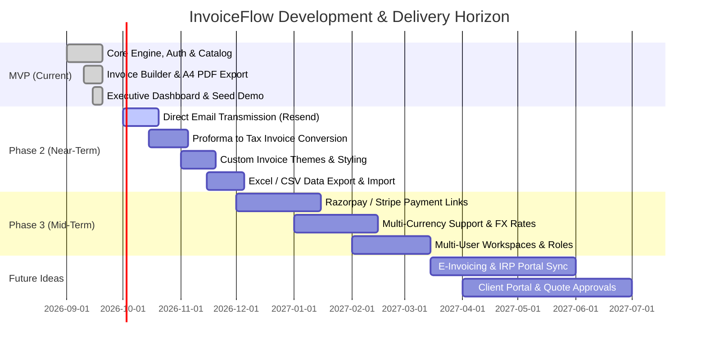

# Product Roadmap — InvoiceFlow

**Document Version:** 1.0.0  
**Last Updated:** September 2026  
**Status:** Active  

---

## Roadmap Overview

---

## 1. Phase 1 — MVP (Current Release) 🎯

The MVP delivers the core end-to-end foundation required to manage billing data and generate legally sound proforma invoices.

### Delivered Capabilities
- **Authentication & Tenant Isolation:**
  - Secure email/password registration and sign-in.
  - Salted password hashing via `bcryptjs`.
  - Edge-compatible JWT verification via `jose` stored in secure HTTP-only cookies.
  - Route-guard middleware protecting internal application routes.
- **Product Catalog Management:**
  - Full CRUD operations for products and billable services.
  - Preset SKU codes, standard billing units, categories, and descriptions.
  - Multi-tier GST tax rates (0%, 5%, 12%, 18%, 28%).
- **Client Directory:**
  - Full CRUD operations for customer records.
  - Storage of verified 15-digit GSTIN tax numbers.
  - Synchronized billing and delivery/shipping addresses.
- **Interactive Proforma Invoice Builder:**
  - Automated sequential proforma numbering (`PI-YYYY-XXX`).
  - 1-Click client auto-fill into buyer section.
  - Dynamic line-item builder with catalog item auto-population.
  - Real-time client-side and server-validated calculation of line tax, subtotal, discounts (percentage or flat), aggregate GST, and grand total.
  - Dynamic legal number-to-words generation (Indian numbering system: *Lakhs* and *Crores*).
  - Tabbed Live Preview allowing operators to inspect the document before saving.
- **Pixel-Perfect A4 PDF Output:**
  - Standard A4 portrait layout with clean 12mm print margins.
  - Native browser print and PDF export with dedicated `@media print` rules hiding navigation and controls.
- **Invoice Archive & Status Management:**
  - Status lifecycle management (`DRAFT`, `SENT`, `ACCEPTED`, `DECLINED`, `EXPIRED`).
  - Searchable and filterable invoice history table.
- **Dashboard & Business Settings:**
  - 4 Executive KPI cards (Invoices count, Total Revenue, Catalog items, Saved clients).
  - Recent invoices table.
  - 1-Click demo seeder to populate sample data for rapid exploration.
  - Seller business profile management (Name, Address, Phone, GSTIN, Default Currency).

---

## 2. Phase 2 — Near-Term Enhancements (Q4 2026) 🚀

Phase 2 focuses on workflow velocity, client communications, and format extensibility.

### 2.1 Direct Email Delivery (SMTP / Resend API)
- Send proforma invoices directly from InvoiceFlow to client email addresses.
- Automatically attach the generated PDF to the email.
- Customizable email message templates with subject line macros (e.g. `[InvoiceFlow] Proforma Invoice PI-2026-001 from {CompanyName}`).
- Delivery status logging (`Sent`, `Delivered`, `Failed`).

### 2.2 Direct Proforma to Tax Invoice Conversion
- 1-Click action button on `ACCEPTED` proforma invoices: **"Convert to Tax Invoice"**.
- Automatically copies line items and metadata to a new formal Tax Invoice record with its own sequential series (e.g. `INV-2026-001`).
- Records payment confirmation (Advance received, balance due).

### 2.3 Customizable Invoice Design Themes
- Selection between 3 distinct visual themes in Settings:
  - **Corporate Classic:** Traditional bordered table layout ideal for industrial/manufacturing suppliers.
  - **Modern Minimalist:** Clean, unbordered, high-whitespace aesthetic preferred by tech agencies and design studios.
  - **Compact Thermal:** High-density layout optimized for compact multi-item parts shipments.
- Custom brand accent color picker for table headers and highlights.
- Company logo upload support.

### 2.4 Excel & CSV Import/Export
- Bulk import products and clients from standard `.xlsx` or `.csv` files.
- Export quarterly invoice history to Excel for chartered accountant and GST filing reconciliation (GSTR-1 preparation).

---

## 3. Phase 3 — Growth & Scaling (Q1 2027) 📈

Phase 3 transitions InvoiceFlow from a single-operator utility into an integrated financial pipeline.

### 3.1 Integrated Payment Links (Razorpay / Stripe / UPI)
- Automatically generate embedded Razorpay or Stripe payment links and dynamic UPI QR codes directly on the Proforma Invoice PDF.
- Clients can scan the QR code using any UPI app (GPay, PhonePe, Paytm) to clear advance deposits immediately.
- Automatic webhook listener marking invoice status as `ACCEPTED` upon payment capture.

### 3.2 Multi-Currency & Real-Time FX Conversion
- Support for issuing proformas in USD (`$`), EUR (`€`), GBP (`£`), and AED (`AED`).
- Real-time foreign exchange rate fetching with dual currency display (e.g., USD contract value with INR GST tax equivalents for Indian export compliance).

### 3.3 Multi-User Workspaces & Role-Based Permissions
- Multi-user team support per organization:
  - **Admin / Owner:** Full access to business settings, API keys, and deletion controls.
  - **Accountant / Sales Rep:** Can create, edit, and send invoices; read-only access to company settings.
  - **Viewer / Auditor:** Read-only access to invoice archives and reports.

### 3.4 Recurring Proforma Invoicing & Retainers
- Automated recurring invoice generation for monthly agency retainers and annual software licenses.
- Scheduled email dispatch on the 1st of every month.

---

## 4. Future Vision & Long-Term Concepts (2027+) 🔮

### 4.1 Indian Government E-Invoicing & IRP Integration
- Direct integration with Invoice Registration Portals (IRP) for B2B transactions meeting government turnover thresholds.
- Generation of government-signed IRN (Invoice Reference Number) and official signed QR codes.

### 4.2 Interactive Client Portal
- Clients receive a secure, branded link (`app.invoiceflow.io/view/inv_xyz`) where they can view the proforma invoice online.
- 1-Click "Approve & Request Tax Invoice" button for procurement teams.
- Digital signature capture directly within the web view.

### 4.3 Automated Payment Reminders & WhatsApp API Dispatch
- Automated WhatsApp notifications via official WhatsApp Business API with one-click PDF download link.
- Friendly validity expiration reminders 48 hours prior to the `validUntil` deadline.

### 4.4 Advanced Analytics & Cash Flow Forecasting
- Expected pipeline value forecasting based on open proforma quotations.
- Conversion rate analytics: percentage of issued proformas converted to accepted contracts.
- Average days to PO sign-off per client.
